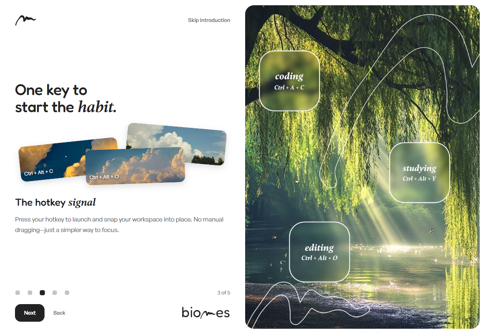
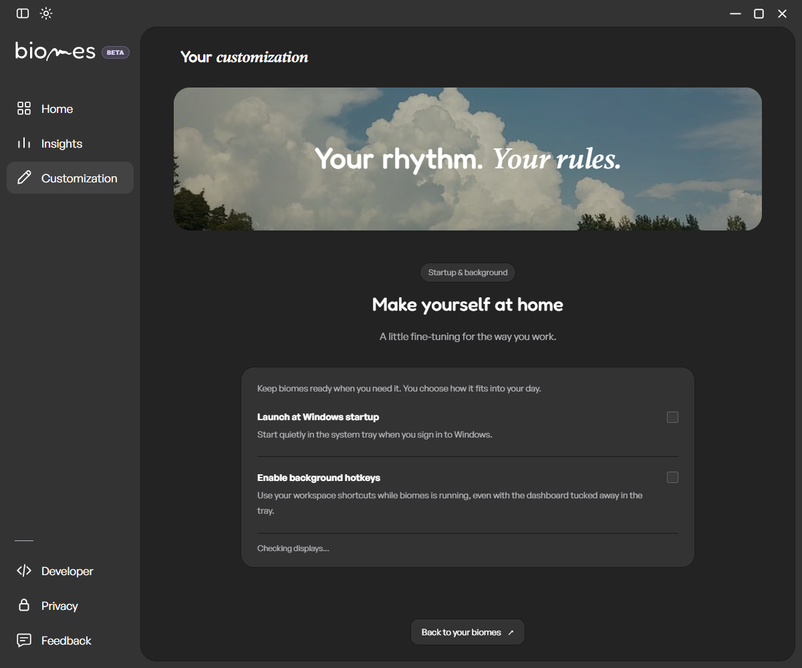
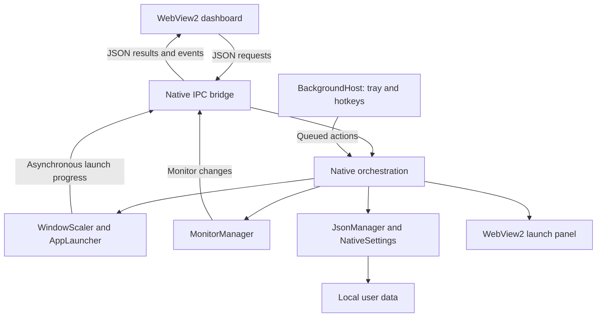

<p align="center">
  <picture>
    <source media="(prefers-color-scheme: dark)" srcset="frontend/logo/logo%20biomes%20white.svg">
    
  </picture>
</p>

<h1 align="center">biomes: Windows workspace manager and window grid layout app</h1>

<h3 align="center">Launch your biome. Trigger your routine.</h3>

<p align="center">Your apps, in their places. Less setup between you and the work you want to do.</p>

<p align="center">
  <a href="https://github.com/AbdelGhafourRebbouh/biomes/releases/tag/v1.0.0-beta"></a>
  <a href="https://github.com/AbdelGhafourRebbouh/biomes/releases"></a>
  
  
  <a href="LICENSE"></a>
</p>

<p align="center">
  <a href="https://biomes-one.vercel.app/">Website</a> ·
  <a href="https://github.com/AbdelGhafourRebbouh/biomes/releases/download/beta/biomesSetup.exe">Download beta for Windows</a> ·
  <a href="https://biomes-one.vercel.app/assets/biomes-demo.mp4">Watch the demo (video)</a>
</p>

**biomes** is a free, open-source Windows workspace manager for people with more than one interest. Build a layout for designing, programming, studying, or whatever you want to make time for. Bring it back with a click or a hotkey, and make getting started part of your routine.

Save and restore window layouts, snap windows to a grid, and keep separate multi-monitor workspaces for each activity. With a saved biome, you can launch apps and arrange them with a hotkey instead of rebuilding your desktop every time.

### See biomes in action

[](https://biomes-one.vercel.app/assets/biomes-demo.mp4)

**[Watch the demo video](https://biomes-one.vercel.app/assets/biomes-demo.mp4)** · [Visit the biomes website](https://biomes-one.vercel.app/)

The image above is a screenshot linked to the video, not an animated preview.

<details>
<summary>See the Customization page</summary>



Screenshots use isolated test profiles, without personal workspace data.

</details>

## 💡 Why biomes? The story

I'm a designer, a programmer, and a student. Each part of my day has its own workspace: a few apps I want open, arranged in the same places.

Before I could start, I kept repeating the same setup. Open the apps. Move the windows. Resize them. Do it all again when switching from a design project to code or studying. Those small steps took time and made it easier to get distracted or move to another task before I'd really begun.

I built biomes to remove that friction. A biome is a familiar place for one part of your life. Set it up once, then return to it when you're ready to work. The idea is to make organizing your screen easier and help build the habit of starting—not to tell you how to spend your time.

biomes is free and open source. Your workspace layouts and settings stay on your computer. No account is required to manage your workspaces.

## ✨ Features

### Workspace management

- **One-click activation:** reopen missing apps and place available windows into saved grid zones.
- **A layout for every interest:** name your biomes, choose covers, and give each workspace its own hotkey.
- **Multi-monitor layouts:** save relative window bounds and layout variants for different display setups. Recalculate placement when resolution, work area, or DPI changes.
- **Disconnected-display handling:** skip zones on missing monitors rather than silently moving them onto the wrong display. Layout repair is available separately.
- **Session-aware placement:** track previous window positions and restore them where possible when closing a biome. Applications remain open.

### System integration

- **Global hotkeys:** activate a biome while working in another app.
- **System tray:** keep the background engine available when the dashboard is hidden.
- **Optional Windows startup:** enable per-user startup and background hotkeys from Customization.
- **Native app launching:** support ordinary desktop apps, Microsoft Store activation identities, and Obsidian vault links.
- **Local storage:** layouts, settings, logs, images, and the WebView2 profile live under `%LOCALAPPDATA%\biomes\`.

### Engine resilience

- **15-second launch watchdog:** report an app that fails to expose a usable window instead of leaving a spinner running indefinitely.
- **Asynchronous window tracking:** watch for new and replacement windows without blocking the dashboard.
- **WebView2 recovery:** attempt to recreate a failed UI controller while keeping the background engine alive and preserving its profile.
- **Per-user installation:** install without administrator elevation. Ordinary uninstall removes app files and shortcuts while preserving your biomes data.

**Privacy boundary:** workspace management is local. Optional community links and newsletter signup use external services; newsletter signup sends the submitted form data. biomes checks GitHub for beta updates at startup and every six hours while running; installing an update requires confirmation. Microsoft WebView2 installation and updates also use Microsoft's services.

### Make your first biome

1. Choose **Create New Biome** and draw zones on your monitors.
2. Press **Enter** to enter snap mode, then drag your open application windows onto the zones.
3. Press **Enter** again and save a name, cover, and optional hotkey such as `CTRL+ALT+C`.
4. Activate the biome from its card or hotkey. Trigger it again to close the session.

Closing the dashboard keeps biomes in the tray. Use **Exit biomes** to end the background process.

## biomes vs FancyZones, komorebi, and PowerToys

Looking for a FancyZones alternative or comparing Windows workspace managers? These tools overlap, but focus on different workflows. **FancyZones is part of PowerToys**, and PowerToys also includes a separate **Workspaces** utility that launches saved app arrangements.

| Tool | Main purpose | Layout and launch workflow | Where biomes differs |
| --- | --- | --- | --- |
| **biomes** | Saved, named workspaces for different activities | Draw grid zones, assign apps, then activate the workspace with a card or global hotkey | A dedicated visual workspace library with covers, per-biome hotkeys, topology variants, and session-aware placement |
| [FancyZones (PowerToys)](https://learn.microsoft.com/en-us/windows/powertoys/fancyzones) | Snap individual windows into custom zones | Arrange windows with dragging or keyboard shortcuts; remember zone assignments | biomes pairs zones with app launch targets and activates the saved group, rather than focusing only on snapping windows |
| [komorebi](https://github.com/LGUG2Z/komorebi) | Tiling window management | Control windows, virtual workspaces, and monitors through configuration and a CLI, with shortcut integrations | biomes focuses on explicitly launching saved app-and-zone arrangements through a visual dashboard, rather than a tiling-manager workflow |
| [PowerToys Workspaces](https://learn.microsoft.com/en-us/windows/powertoys/workspaces) | Capture and relaunch desktop arrangements within the PowerToys suite | Capture app positions, configure launch arguments, and launch a workspace with a click or desktop shortcut | biomes starts with drawn grid zones and adds its own card library, per-biome global hotkeys, and session-close behavior |

PowerToys Workspaces already supports launching and positioning groups of apps; this is not exclusive to biomes. Choose based on whether you prefer zone snapping, tiling, captured desktop arrangements, or biomes' saved grid-based routines. All workspace tools remain subject to individual apps' launch and resizing behavior.

## 🛠️ Architecture & tech stack

| Component | Technology | Responsibility |
| --- | --- | --- |
| Native engine | C++17 and Win32 | App launching, window placement, display topology, hotkeys, and tray lifetime |
| Dashboard and launch panel | Microsoft WebView2, HTML, CSS, JavaScript | Workspace UI, onboarding, settings, and launch progress |
| IPC bridge | JSON messages over WebView2 | Route UI requests and return native state and events |
| Persistence | Local JSON; nlohmann/json | Workspace layouts, topology variants, and native settings |
| Build | CMake and MSVC | Native compilation, resource embedding, asset copying, and regression tests |
| Distribution | PowerShell and Inno Setup | ZIP packaging, per-user installer, and WebView2 Evergreen bootstrapper |



The hidden native host owns process lifetime. Closing or recovering the dashboard does not end the background engine. WinEvent hooks and periodic checks discover application windows and verify placement after launch.

See [AGENTS.md](AGENTS.md) for the detailed architecture and contributor instructions. Source code and tests are authoritative.

## 🤖 AI co-development workflow

I use **Codex**, with some **Cursor**, as part of developing biomes. AI has helped me research Windows APIs, investigate bugs, fix errors, organize code, write code comments and commit messages, and refine the interface and build scripts.

A workspace manager has to interact with applications built using very different technologies. A traditional Win32 app, an Electron app, and a Microsoft Store app can behave differently when launched, resized, minimized, or restored. Making those cases work has meant a lot of research into Win32 and a lot of testing.

AI helps me explore those problems and iterate on possible fixes. The design direction and responsibility for the project remain mine. Suggested changes still need to be checked against the implementation, regression tests, and real application behavior. biomes itself does not require an AI model or AI service to run.

## ⬇️ Download & installation

**v1.0.0-beta is available as a published prerelease for Windows x64.**

<p align="left">
  <a href="https://github.com/AbdelGhafourRebbouh/biomes/releases/download/beta/biomesSetup.exe">
    
  </a>
  <a href="https://github.com/AbdelGhafourRebbouh/biomes/releases">
    
  </a>
</p>

- [v1.0.0-beta release notes]([https://github.com/AbdelGhafourRebbouh/biomes/releases/tag/v1.0.0-beta](https://github.com/AbdelGhafourRebbouh/biomes/releases/download/beta/biomesSetup.exe))
- [Current beta release](https://github.com/AbdelGhafourRebbouh/biomes/releases/tag/beta) · [Project website](https://biomes-one.vercel.app/)

### Updates

The download button uses one permanent address:

```text
https://github.com/AbdelGhafourRebbouh/biomes/releases/download/beta/biomesSetup.exe
```

Use this address wherever you share biomes: it serves the latest successfully published beta installer.

Each successful push to `main` builds, tests, and publishes a versioned beta, then refreshes the permanent download and update feed. Failed builds do not replace the previous download. Older versioned releases remain available.

Updater-enabled versions notify you through the system tray. Click the notification or right-click the tray icon and choose **Update and restart...**. You can also use **Check for updates...**. The installer downloads only after confirmation, is checked against the release SHA-256, and preserves your saved layouts and settings.

**Existing v1.0.0-beta users need to install an updater-enabled release once manually.** The original beta cannot receive this capability remotely. This update channel distributes beta builds, and the installer remains unsigned until code signing is funded.

### Requirements

- **Windows 10 or Windows 11, 64-bit (x64).**
- **Microsoft WebView2 Evergreen Runtime.** Setup includes Microsoft's bootstrapper for machines where the runtime is missing; that installation requires internet access.

Run `biomesSetup.exe` and follow the installer. It installs per user under `%LOCALAPPDATA%\Programs\biomes`, creates a Start Menu shortcut, and offers an optional Desktop shortcut.

The beta installer is currently **unsigned**, so Windows may show an unknown-publisher or SmartScreen warning. Code signing is a funding priority. Download from this repository's releases and use the accompanying SHA-256 checksum to verify the downloaded file.

Before upgrading, exit the running app through its tray menu. Your personal data under `%LOCALAPPDATA%\biomes\` is preserved during ordinary upgrades and uninstall. See [RELEASE.md](RELEASE.md) for ZIP deployment and bootstrapper details.

### WinGet and Scoop

Use the GitHub installer above for now. Verified WinGet and Scoop package IDs are not documented yet; install commands will be added after package manifests are published and validated. The similarly named **Biome/BiomeJS** packages are a different project, not this Windows workspace manager.

## 🔨 Building from source

Install **Git**, **Visual Studio 2022** with the **Desktop development with C++** workload and Windows SDK, and **CMake 3.20+**. WebView2 Runtime is needed to run the app and its UI tests. The JSON and WebView2 headers are included in the repository; the frontend needs no Node.js build.

From a Visual Studio developer PowerShell:

```powershell
git clone https://github.com/AbdelGhafourRebbouh/biomes.git
cd biomes
cmake -S . -B build-stability -G "Visual Studio 17 2022" -A x64 -DBIOMES_BUILD_TESTS=ON
cmake --build build-stability --config Release --parallel 4
ctest --test-dir build-stability -C Release --output-on-failure --no-tests=error
.\build-stability\Release\Biomes.exe
```

If using another supported Visual Studio version, select its installed CMake generator. The build copies the frontend, fonts, images, and `WebView2Loader.dll` beside the executable. Exit any older running instance before rebuilding or checking UI changes.

### Create the installer

Install **Inno Setup 6**, then run:

```powershell
.\scripts\build_installer.ps1
# Or specify your compiler location:
.\scripts\build_installer.ps1 -IsccPath "C:\Program Files (x86)\Inno Setup 6\ISCC.exe"
```

This builds and tests Release, packages the allowlisted files, and writes `dist\biomesSetup-v1.0.0-beta.exe` and its checksum. To create only the ZIP, run `.\scripts\package_release.ps1`. Both scripts accept `-BootstrapperPath` for a previously downloaded Microsoft-signed WebView2 bootstrapper.

### Additional checks

The 14 native regression suites cover IPC, WebView2 recovery and responsive onboarding, persistence, monitor resolution, placement, launch tracking, storage, and background lifetime.

```powershell
# Optional: Node.js with built-in WebSocket support, plus Microsoft Edge.
node tests/onboarding_tests.mjs
# Optional: Google Chrome; uses temporary profiles.
.\scripts\test_chrome_launch.ps1
```

Real-world checks still matter: mixed-DPI displays, disconnected monitors, global hotkeys, slow apps, session cancellation, and installer upgrades cannot be fully represented by automated fixtures.

## 📂 Project structure

```text
biomes/
├── src/                 C++ implementations; main.cpp orchestrates the app
│   ├── core/            Launching, placement, monitors, storage, IPC, and lifetime
│   └── ui/              WebView2 hosts, grid overlay, launch panel, and tray
├── include/             Core/UI headers and vendored dependencies
├── frontend/            Shipped HTML, CSS, JavaScript, fonts, and artwork
├── resources/           Icon, manifest, and version resources
├── installer/           Inno Setup configuration and installer notes
├── scripts/             Packaging automation and Chrome launch smoke test
├── tests/               Regression suites and launch-panel preview harness
├── tools/               Optional icon generation tool
├── docs/screenshots/    Screenshots used by this README
├── CMakeLists.txt       Build, asset copying, and test registration
├── AGENTS.md            Architecture and contributor instructions
├── RELEASE.md           Deployment guide
└── LICENSE              GNU GPLv3
```

Generated builds, temporary browser profiles, and distribution binaries are excluded from Git.

## 🗺️ Roadmap & cross-platform vision

- [x] Windows workspace layouts, multi-monitor grids, tray lifetime, and global hotkeys.
- [x] Local persistence, launch progress, UI recovery, and per-user beta installer.
- [x] Publish [v1.0.0-beta release notes]([https://github.com/AbdelGhafourRebbouh/biomes/releases/tag/v1.0.0-beta](https://github.com/AbdelGhafourRebbouh/biomes/releases/download/beta/biomesSetup.exe))for Windows x64.
- [ ] Improve beta compatibility from real-world feedback.
- [ ] Publish and validate WinGet and/or Scoop manifests, then document installation commands.
- [ ] Fund Windows code signing.
- [ ] Continue accessibility, display-scaling, and application-compatibility improvements.
- [ ] Explore a macOS version using WKWebView and native window-management APIs.
- [ ] Explore Linux support using WebKitGTK and desktop-specific window-management APIs.

**Windows is the only supported platform today.** macOS and Linux are a longer-term direction, not existing ports or promised release dates. Replacing WebView2 alone would not port the native window engine.

### Current beta limits

Some applications reject resizing or need user interaction before they expose a usable window. Microsoft Store apps should be assigned through their real application window; `ApplicationFrameHost.exe` alone is not a launchable identity. Obsidian requires an identifiable vault.

New Chrome windows use Chrome's last-used profile; per-zone browser account and tab restoration are not implemented. Closing a biome restores tracked placement where possible and minimizes its windows rather than terminating the applications.

## ☕ Community support & funding

biomes is independently built by [Abdelghafour Rebbouh](https://github.com/AbdelGhafourRebbouh). If it saves you time or helps you start your work, you can [support development on Ko-fi](https://ko-fi.com/abdelghafourrebbouh).
<p align="left">
  <a href="https://ko-fi.com/abdelghafourrebbouh">
    
  </a>
</p>

Funding priorities:

| Priority | What support would help cover |
| --- | --- |
| Windows code signing | Signing the installer and application to establish publisher identity |
| Domain and hosting | A project home and distribution/CDN costs as the project grows |
| Cross-platform development | Hardware, testing, and research for possible macOS and Linux versions |

These are goals, not announced funding amounts or delivery commitments. You can also help by reporting reproducible bugs, testing different applications and monitor setups, improving documentation, or contributing fixes.

[Open an issue](https://github.com/AbdelGhafourRebbouh/biomes/issues) with your Windows version, display setup, affected app, and reproduction steps. Keep personal workspace data and sensitive logs out of public reports.

## 📄 License

biomes is free and open-source software under the **GNU General Public License v3.0**. See [LICENSE](LICENSE) for the full terms. Third-party dependencies retain their own notices and licenses.
